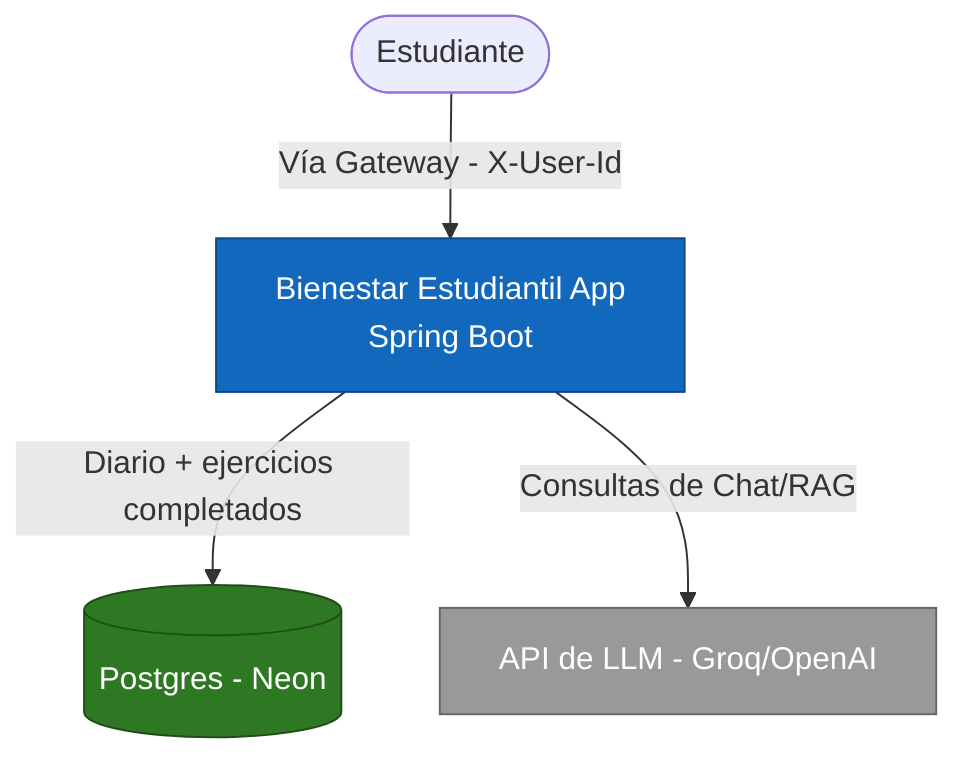
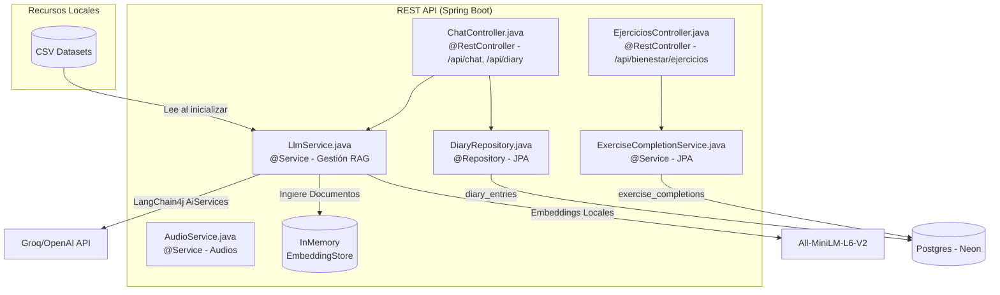
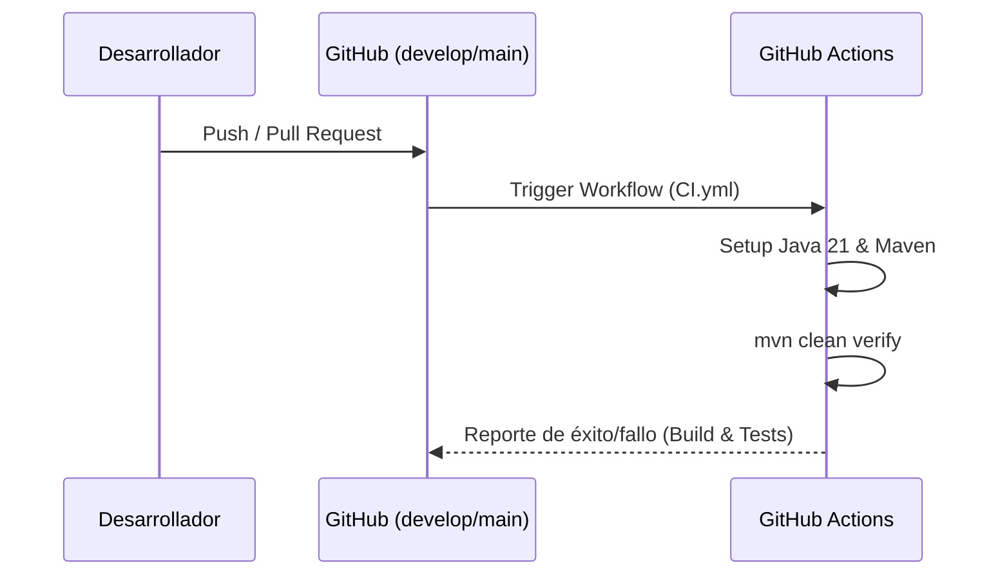

# Bienestar Estudiantil - LLM Backend (Java)

Este proyecto es una aplicación de consola desarrollada en **Java 21**, **Spring Boot**, y **LangChain4j**, diseñada para dar soporte y bienestar a los estudiantes. Utiliza técnicas de *Retrieval-Augmented Generation* (RAG) integradas con un LLM (Groq/OpenAI) y una **Base de Datos Vectorial en Memoria** para responder preguntas, analizar emociones y sugerir contenido de entretenimiento.

## Requerimientos Implementados

- **RF-BNST-01:** Chatbot para Apoyo Estudiantil (RAG con embeddings locales).
- **RF-BNST-02:** Diario de Emociones (persistido por usuario en Postgres/Neon).
- **RF-BNST-03:** Recomendaciones de Desconexión (Basadas en Kaggle).
- **RF-BNST-04:** Catálogo Nativo de Sonidos de Relajación.
- **RF-BNST-05:** Ejercicios Guiados de Respiración.

---

## Cómo Ejecutar el Proyecto

### Requisitos Previos
1. **Java 21 (JDK 21)** instalado en el sistema y configurado en el PATH (o la variable `JAVA_HOME`).
2. Obtener una **API Key** de Groq o OpenAI.
3. Una base de datos Postgres alcanzable (recomendado: una rama de desarrollo en [Neon](https://neon.tech)). El servicio ya no arranca sin ella — Spring Boot falla rápido si el `DataSource`/Flyway no pueden conectar.

### Pasos
1. Abre una consola (PowerShell o CMD) en la carpeta raíz del proyecto (`C:\Users\Isabel\Downloads\LLM-Backend`).
2. Abre el archivo `.env` en la raíz del proyecto y agrega tu llave y las credenciales de la base de datos:
   ```env
   GROQ_API_KEY="tu_llave_real_aqui"
   SPRING_DATASOURCE_URL="jdbc:postgresql://<host>/<db>?sslmode=require"
   SPRING_DATASOURCE_USERNAME="tu_usuario"
   SPRING_DATASOURCE_PASSWORD="tu_password"
   ```
   Al arrancar, Flyway crea automáticamente las tablas `diary_entries` y `exercise_completions` (ver `src/main/resources/db/migration/`).
3. Compila y ejecuta la aplicación (Spring Boot) usando el Maven local que viene incluido en la carpeta `apache-maven-3.9.6`:

   **En PowerShell:**
   ```powershell
   .\apache-maven-3.9.6\bin\mvn spring-boot:run
   ```

   **En CMD (Símbolo del sistema):**
   ```cmd
   apache-maven-3.9.6\bin\mvn spring-boot:run
   ```

4. ¡Disfruta usando el menú desde tu terminal!

### Cómo Ejecutar las Pruebas Unitarias
El proyecto cuenta con pruebas unitarias usando JUnit 5 y Spring Boot Test. Para ejecutarlas:
```powershell
.\apache-maven-3.9.6\bin\mvn clean test
```

## Arquitectura y Contexto (Diagramas)

### Diagrama de Contexto (C4 - Nivel 1)
Este diagrama muestra cómo interactúa el estudiante (Usuario) con el sistema LLM-Backend y los servicios externos (Groq/OpenAI).



### Diagrama de Arquitectura (C4 - Nivel 2)
Este diagrama detalla los componentes internos de la aplicación y la inyección de dependencias con Spring.



## Integración Continua (CI/CD) y Análisis de Código

### Pipeline de Integración Continua
Se ha implementado un pipeline de GitHub Actions (`.github/workflows/CI.yml`) que se ejecuta en cada Push o Pull Request a las ramas `develop` y `main`.
Este pipeline automatiza:
1. Configuración del entorno (Java 21, Maven).
2. Ejecución de pruebas unitarias y de integración (`mvn clean verify`).
3. Validación de umbrales de cobertura.



### Cobertura de Código (JaCoCo)
El proyecto utiliza el **JaCoCo Maven Plugin** para medir la cobertura del código.
Durante la fase `verify` de Maven, se genera un reporte en `target/site/jacoco/index.html`. Además, se ha configurado un umbral que requiere un **80% mínimo de cobertura** de líneas para que el build se considere exitoso.

## Datasets Usados (Kaggle)
Este proyecto lee informacion en tiempo real de dos datasets alojados en `src/main/resources/data/` que son ingeridos en la memoria al iniciar el contexto de Spring:
1. `mental_health_faq.csv`: Base de datos para soporte estudiantil.
2. `netflix_titles.csv`: Base de datos para recomendaciones de entretenimiento.